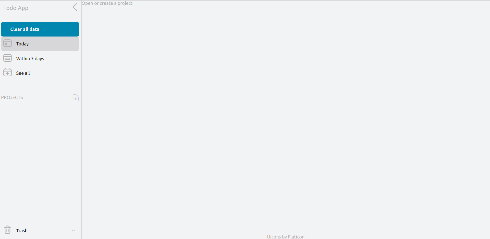
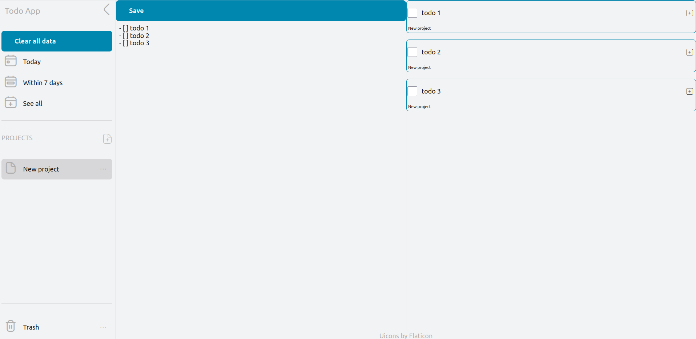

# To-do list

[live demo](https://iren42.github.io/top-todoList/)

An assignment from The Odin Project's curriculum.
This is a website made with webpack, Javascript, HTML and CSS.


## Installation
Steps:
1. Clone this repository
```sh
git clone https://github.com/iren42/top-todoList.git
```
2. Install npm dependencies
```sh
cd top-todoList && npm install
```
3. Create dist/ directory with all our bundled files
```sh
npm run build
```
4. In dist/, open the file "index.html" with your browser (Chrome is prefered)

## How it works
> **__To read before starting:__**
> - Deleting a project will delete all of its to-do tasks
> - To-do tasks are forever bound to the project that created them
> - To-do tasks are also bound to its corresponding project's line number from the editor [¹](#how-are-to-do-tasks-identifier-made)
> - To-do tasks with a due date that has already passed are automatically thrown in the "Trash" bin
> - The "Trash" bin does not automatically empty itself

### Get started
1. Create a new project by clicking on the sidebar icon next to "PROJECTS"
1. Write stuff in the center of the page with the "Write here..." text (this is called the editor)
1. Write a to-do task by prefixing your task by "- [ ] " (be sure to add the whitespaces)
E.g.

1. Click on the "Save" button
1. You have created to-do tasks. The app should look like this:


## Things it can do
- Create projects and to-do tasks
- Check to-do tasks in the task object (on the right side of the page)
- Check to-do tasks in the editor by replacing the prefix "- [ ] " to "- [x] " (it is the markdown syntax). Always remember to save the latest changes made in the editor
- Edit to-do task in the editor and in the task object
- Add a due date and a due time to the tasks
- Change a task's priority level
- Delete tasks in the editor by deleting the to-do prefix ("- [ ] " or "- [x] ")
- Rename projects and to-do tasks
- Delete projects and to-do tasks

## My choices (why I made my app like that)
I wanted to be able to create multiple to-do tasks at once, without having to constantly click on buttons.
I used the markdown syntax because I like markdown, I use it for my personal notes.

## More informations
### How are to-do tasks' identifier made
A to-do task's ID is made of its project's line number and its project's ID.
